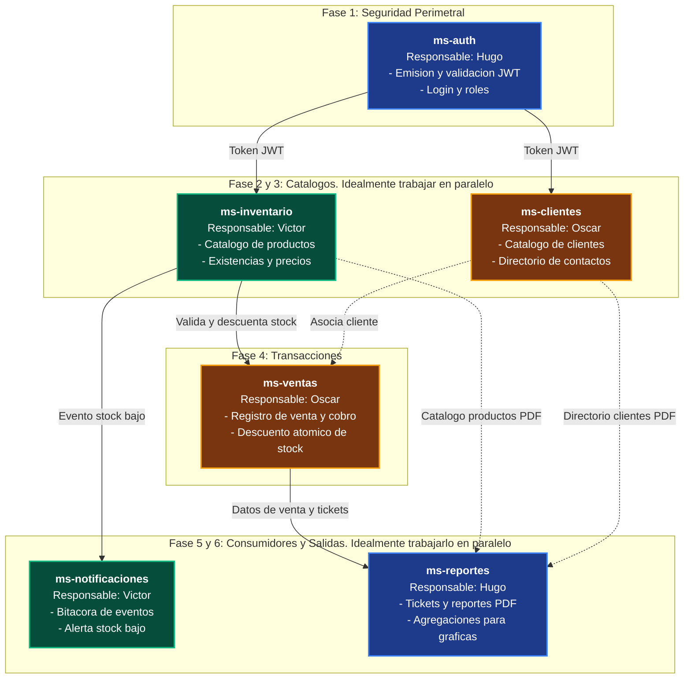

# Documentación técnica y diagramas de arquitectura
## Mapa de Construcción y Dependencias de Microservicios

```mermaid
flowchart TD
    
    classDef hugo fill:#1E3A8A,stroke:#3B82F6,stroke-width:2px,color:#FFFFFF;
    classDef victor fill:#064E3B,stroke:#10B981,stroke-width:2px,color:#FFFFFF;
    classDef oscar fill:#78350F,stroke:#F59E0B,stroke-width:2px,color:#FFFFFF;

    subgraph FASE1 [Fase 1: Seguridad Perimetral]
        AUTH["<b>ms-auth</b><br>Responsable: Hugo<br>- Emision y validacion JWT<br>- Login y roles"]:::hugo
    end

    subgraph FASE2 [Fase 2 y 3: Catalogos. Idealmente trabajar en paralelo]
        direction LR
        INV["<b>ms-inventario</b><br>Responsable: Victor<br>- Catalogo de productos<br>- Existencias y precios"]:::victor
        CLI["<b>ms-clientes</b><br>Responsable: Oscar<br>- Catalogo de clientes<br>- Directorio de contactos"]:::oscar
    end

    subgraph FASE3 [Fase 4: Transacciones]
        VENTAS["<b>ms-ventas</b><br>Responsable: Oscar<br>- Registro de venta y cobro<br>- Descuento atomico de stock"]:::oscar
    end

    subgraph FASE4 [Fase 5 y 6: Consumidores y Salidas. Idealmente trabajarlo en paralelo]
        direction LR
        NOTIF["<b>ms-notificaciones</b><br>Responsable: Victor<br>- Bitacora de eventos<br>- Alerta stock bajo"]:::victor
        REP["<b>ms-reportes</b><br>Responsable: Hugo<br>- Tickets y reportes PDF<br>- Agregaciones para graficas"]:::hugo
    end

    %% Relaciones y dependencias
    AUTH -->|Token JWT| INV
    AUTH -->|Token JWT| CLI

    INV -->|Valida y descuenta stock| VENTAS
    CLI -.->|Asocia cliente| VENTAS

    INV -->|Evento stock bajo| NOTIF
    VENTAS -->|Datos de venta y tickets| REP
    INV -.->|Catalogo productos PDF| REP
    CLI -.->|Directorio clientes PDF| REP
```